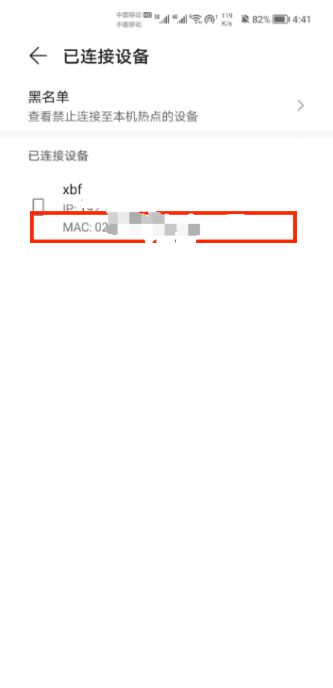
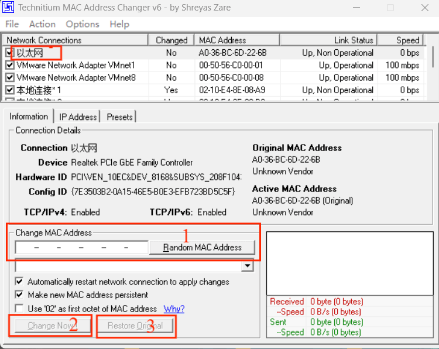
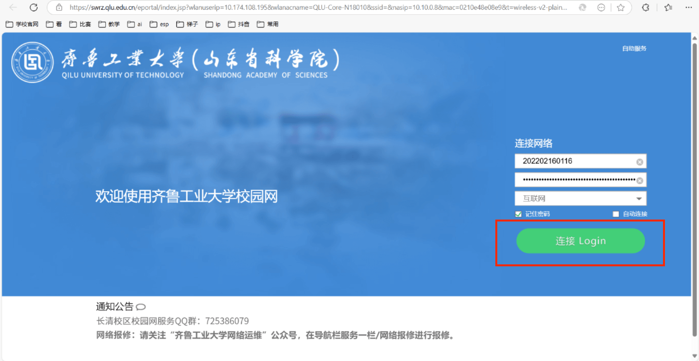
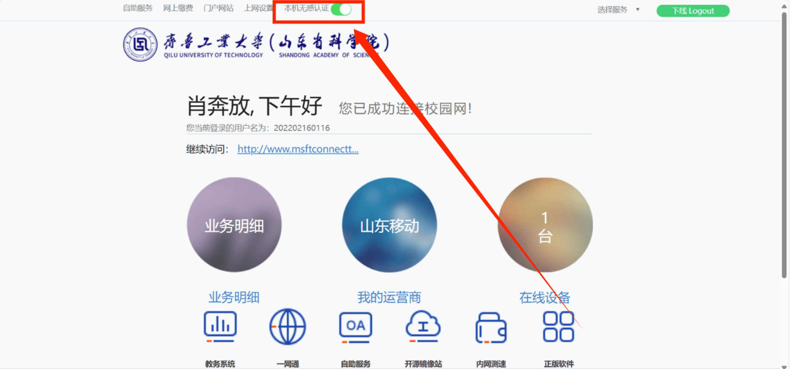

\---

title: esp01s连接校园网（齐工大）

date: 2025-03-20

tags:

 \- esp01s

categories:

 \- 单片机通信

\---

### **简介**

需要熟悉**audrino ide**或**AT固件指令**使esp01s连接wifi的操作，这些在网络上很容易找到。

### 1.**环境**

**2个软件**：audrino ide，tamc v6

其中**audrino ide**不是必须有的，通过固件AT指令连接wifi也可以。

现在可以先准备**audrino ide**。

**tamc v6** 后面再下载。

不废话，直接说怎么连接校园网，就不解释为什么这么做了。

### **2.准备**

**2.1 获取esp01s的mac地址**

将esp01s连接手机热点，然后在手机上查看已连接设备，获取mac地址，如下图

**2.2 更改电脑的mac地址**

更改电脑的mac地址为esp01s的mac地址

需要用到一个软件TMAC V6。

下载链接

::: tip one

地址1：
https://technitium.com/tmac/
地址2：
链接：https://pan.baidu.com/s/1-jtwQ936gtepVWXKo_qwfg
提取码：2n1s

:::

具体怎么使用看下面的步骤或者https://blog.csdn.net/qq_48081868/article/details/132454947

1.在1内输入刚刚获取的esp01s的mac地址

2.先记住上面红框以太网后面的MAC Address（用于后面恢复mac 地址时比对），然后点击2,change now

3.关闭电脑WLAN网罗，然后打开连接校园，进入下面这个界面（如果没有需要用手机连接校园网把电脑顶掉）

点击**连接Login**之后不要关闭网页，等待10秒左右。

4.等待一会会进入下面这个网页

打开无感认证

5. 恢复电脑mac码

   点击3 Restore，然后比对一下以太网的MAC地址是否恢复到原来的，如果是则正常。

   如果不是则需要吧电脑的mac地址修改为原来的，这种情况几乎不会发生

，

### 3.**连接校园网**

WiFi：	"QLU-2.4G"  // 要链接的校园网名字

password：" "               //  空的

只提供校园网的名字和空密码即可，无需其他信息。

通过audrino ide 或者 AT指令配置好之后**上电自动连接校园网**。

### 4.**结语**

有问题联系     QQ：488763619